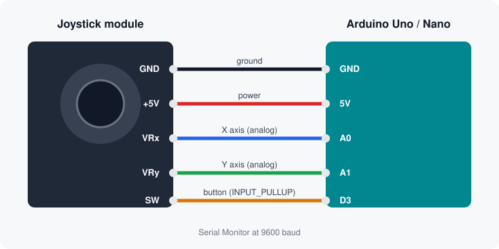

# Electrical Circuits – Microcontroller Code

[](https://github.com/skyxiel/Electrical-Circuits-Microcontroller-code/actions/workflows/compile.yml)

Arduino sketches for testing and building small electronic circuits.

| Sketch | What it does |
| --- | --- |
| [`joystick_test`](joystick_test/joystick_test.ino) | Checks that an analog thumb-joystick module (KY-023 / PS2-style) is wired correctly: prints X/Y readings, stick direction and button clicks to the Serial Monitor. |

---

## Joystick test

### You'll need

- Arduino Uno, Nano, or any board with 5 V analog inputs
- 2-axis joystick module with a push button (5 pins: GND, +5V, VRx, VRy, SW)
- 5 jumper wires

### Wiring



| Joystick pin | Arduino pin | Notes |
| --- | --- | --- |
| GND | GND | |
| +5V | 5V | Use 3.3V instead on 3.3 V boards |
| VRx | A0 | X axis |
| VRy | A1 | Y axis |
| SW  | D3 | Uses the internal pull-up, so it reads `LOW` when pressed |

### Upload and run

1. Open `joystick_test/joystick_test.ino` in the Arduino IDE.
2. Pick your board and port under **Tools**, then click **Upload**.
3. Leave the stick centered while the board resets. It measures the resting position at startup.
4. Open **Tools → Serial Monitor** and set the baud rate to **9600**.

Or with [arduino-cli](https://arduino.github.io/arduino-cli/):

```bash
arduino-cli compile --fqbn arduino:avr:uno joystick_test
arduino-cli upload  --fqbn arduino:avr:uno -p COM3 joystick_test
arduino-cli monitor -p COM3 -c baudrate=9600
```

(Replace `COM3` with your port, e.g. `/dev/ttyACM0` on Linux or `/dev/cu.usbmodem*` on macOS.)

### What you should see

```
=== Joystick test starting ===
Leave the stick centered for a moment...
Center measured at X: 507   Y: 498
Move the stick and click it.
Commands: p = toggle plotter mode, c = recalibrate center, h = help
X: 507   Y: 498   SW: released   Dir: CENTER
X: 0   Y: 501   SW: released   Dir: LEFT
>> Click #1
X: 506   Y: 499   SW: PRESSED    Dir: CENTER
```

- **Centered:** X and Y both around 500 (usually 480–520; exactly 512 is rare).
- **Left / right:** X swings toward 0 or 1023.
- **Up / down:** Y swings toward 0 or 1023.
- **Click:** `SW` shows `PRESSED` and a `>> Click #n` line is printed once per click.

### Serial commands

Type a letter in the Serial Monitor's input box and press Enter:

| Key | Action |
| --- | --- |
| `p` | Toggle **Serial Plotter** mode. Close the Monitor and open **Tools → Serial Plotter** to see X, Y and the button as live graphs. |
| `c` | Re-measure the center position (leave the stick alone first). |
| `h` | Show the command list again. |

### Settings

These constants near the top of the sketch can be changed:

| Constant | Default | Meaning |
| --- | --- | --- |
| `VRX_PIN`, `VRY_PIN`, `SW_PIN` | `A0`, `A1`, `3` | Pins the joystick is connected to |
| `PRINT_INTERVAL_MS` | `200` | Time between printed readings |
| `DEADZONE` | `100` | How far the stick must move from center before a direction is reported |
| `DEBOUNCE_MS` | `30` | Button debounce time |

### Troubleshooting

| Symptom | Likely cause |
| --- | --- |
| Nothing in the Serial Monitor, or garbled text | Baud rate isn't set to 9600, or the wrong port is selected |
| X or Y stuck at 0 or 1023 | That VR wire is loose or on the wrong pin, or +5V/GND is disconnected. The sketch prints a `WARNING` at startup when this happens. |
| X or Y jumps around randomly | That VR wire isn't connected, so the analog pin is floating |
| X and Y are swapped, or directions are reversed | Module orientation differs; some boards label the axes the other way. Swap `VRX_PIN`/`VRY_PIN` or rotate the module. |
| SW always `released` | SW wire isn't on D3, or the module's button is faulty |
| SW always `PRESSED` | SW is wired to GND instead of D3 |
